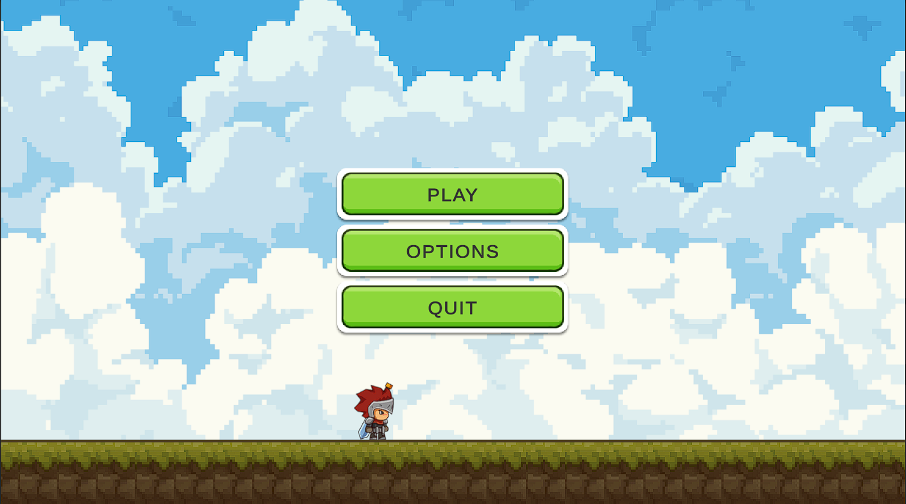
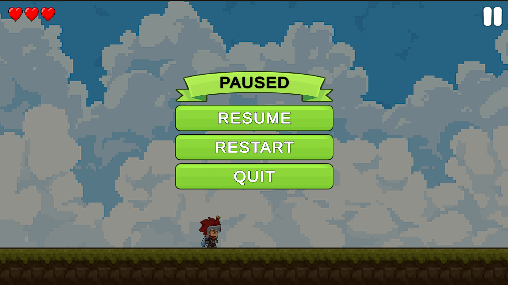

# 2D Game — Development Showcase (v0.4)

Welcome! 👋  
This repository showcases my progress as I develop a **2D action game in Unity**.  
The game is still in production, and this is a **public development showcase** of the project.

---

## 🎥 Showcase Video

_Click the image to watch the gameplay video on Google Drive._

---

## 🖥️ UI & Menus Showcase

### Main Menu UI

### Pause Menu UI

---

🚀 Stage 4 Progress (Implemented)

### Core Systems
- Health system (player + enemies)
- Combat foundations with working damage and hit interactions
- Hit feedback systems:
  - Hit flash (visual feedback on impact)
  - Hit knockback (player/enemy pushback)
  - Hitstop (brief time freeze on hit for impact feel)
- UI system implemented
- Pause system with:
  - Resume
  - Restart
  - Quit
  - Return to Main Menu
- Improved camera system:
  - Refined camera movement and offset
  - Smoother motion for better gameplay feel and visual clarity

### Player Combat
- Melee combat system for the player

### Enemy Combat & AI
- Melee enemies implemented and placed in the map
- Ranged enemies implemented and placed in the map
- Enhanced enemy AI behavior:
  - Enemies actively follow the player
  - Faster and more aggressive attack patterns
  - Combat now emphasizes quick reactions and smart positioning rather than simple hack-and-slash gameplay

### Playable Content
- Map scene set up with encounters to test combat flow
- Improved combat pacing due to smarter enemy behavior

---

## 🎨 Assets Used

**Player**  
Knight Sprite Sheet Free  
https://assetstore.unity.com/packages/2d/characters/knight-sprite-sheet-free-93897

**Enemy**  
Dragon Warrior Free  
https://assetstore.unity.com/packages/2d/characters/dragon-warrior-free-93896

---

## ⚠️ Status

Development in progress.  
Expect frequent updates, unfinished content, and changes between commits.
